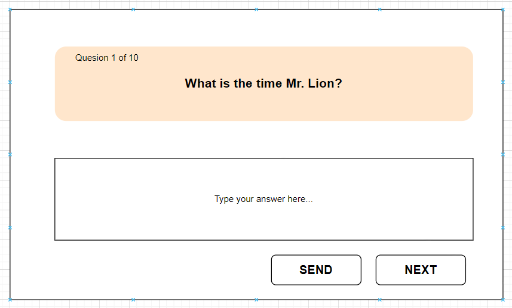
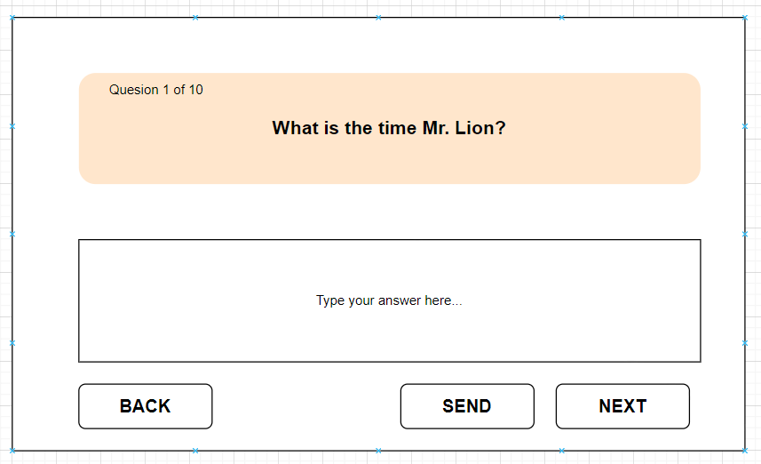
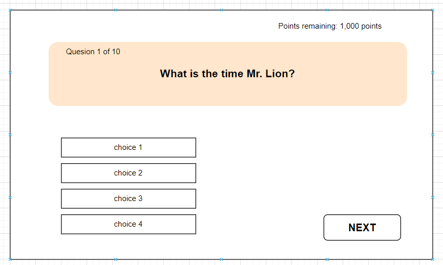
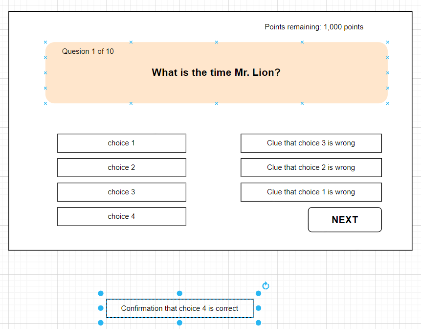
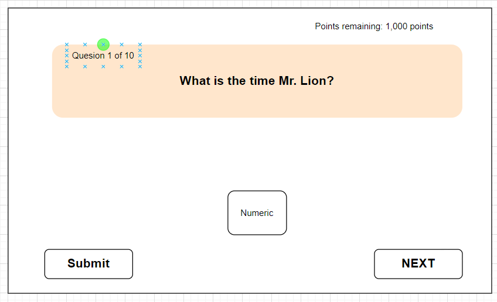
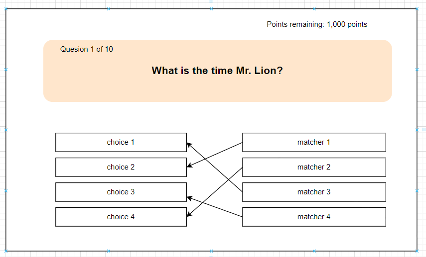

# Design and implementation notes

## Type of games (refer to tbl_playbook for more details - this is still very fluid)

### manual progression vs auto progression

Manual implies that the player is moving at their own pace, and clicking 'Next' to proceed. There is no 'Back' option

Auto implies that the player is not in control of the game progression. The questions are updated based on a timer.

- When the game is being played by an individual (without others participating in the **_same_** game), then "manual" progression is applicable. 

- When the **_same_** game is being played by multiple participants, then "auto" progression is applicable. In this case, "manual" cannot even be considered.

### free_form_forward_only

The response should match the correct answer as closely as possible, as defined by the response criteria.

- question does not have multiple choices. 
- question has no timer. 
- player can only more forward with no option to skip and go back. 
- response to the question is free-form and requires typing, like with a quiz or exam



### free_form_free_flow

The response should match the correct answer as closely as possible, as defined by the response criteria.

- question does not have multiple choices. 
- question has no timer. 
- player can only more forward and backwards freely
- response to the question is free-form and requires typing, like with a quiz or exam



### clue_swipe_out

Wrong choices are **_swiped_** out

- Each choice is **_swiped_** out as time winds down.
- Points decrease as the available time remaining decreases. 
- No points are available when the clock runs out.



Example

- Points start at 1000.
- Delay countdown for 5 seconds (allow player to read question and consider choices)
- start countdown
- for every two seconds, remove a wrong choice from the list of choices. 
- Shave off 100 points per second
- when clock reaches zero, reveal the correct answer and a reason why

### elimination_clues

Clues for the incorrect choices are **_swopped_** in

- Each clue is associated with exactly one choice. 
- Each clue informs whether the choice is correct or incorrect. 
- Each clue is revealed one at a time with delays in between. 
- Points decrease as the available time remaining decreases. 
- No points are available when the clock runs out.



Example

- Points start at 1000.
- Delay countdown for 5 seconds (allow player to read question and consider choices)
- start countdown
- for every two seconds, reveal a clue for an incorrect choice. 
- Shave off 100 points per second
- when clock reaches zero, reveal confirmation of correct answer

### closest_but_not_over

The anwser to thie question must to be a numeric value

- Answers that match the exact numeric value get maximum points. 
- Points decrease with increasing distacne from the correct value. 
- Any answer above correct value gets no points. 
- Any answer below 1 percent of the correct value gets no points either.



The UI is very similar to that of free_form except that the response submited can ONLY be a numeric value.

### choice matcher

Each matcher is associated with exactly one choice only.




### Navigation Paths when playing as a group

- Created Game
	- Cannot join game

- Accepting Game
	- join as Guest
	- join as Registered

- Playing Game
	- join as Guest
	- join as Registered
	

### Parent project directory layout

It contains different projects and other non-project directories under one roof

```title="mind-flip directory"
.
|-- Dockerfile
|-- README.md
|-- __tests__
|-- api-docs    				--- swagger documentation
|-- app.js *					--- server app file
|-- babel.config.js *
|-- bin							--- entry point for mind-flip application				
|-- dev-notes 					--- collection of thoughts and discussions
|-- environment.js *			--- injects secrets in dev environment				
|-- expdemo						--- project used in a blog article
|-- fly.toml					--- config file for deploying to the internet
|-- frontend					--- blog project
|-- handlers *					--- interface to business services
|-- jest-setup.js *
|-- jest.config.js *
|-- middleware *				--- express functions shared amongst handlers
|-- node_modules *
|-- package-lock.json *
|-- package.json *
|-- repo *
|-- requests.rest *				--- alternative for Postman - allows testing right inside vscode
|-- routes *					--- entry point for all server routes
|-- schema						--- backup for sql DDL/DML and Postman collections
|-- service *					--- interfaces to external systems like databases
|-- trivia	*					--- business logic for driving games and pushing events to the UI
|-- web-client					--- mind-flip UI project
`-- wssdemo						--- incubator project for web sockets - to replace SSE in mind-flip UI project
```

### Layout of server project

The items with a __*__ suffix above are all related to the server

```
www
 - app
   - routes + global error-handler
     - handlers + middleware
	   - service (both internal and external interfaces)
```	   

### Layout of the web-client project

This is everything inside the __web-client__ directory

```title="web-client directory"
.
|-- __mocks__					--- still fluid
|-- __tests__					--- still fluid
|-- babel.config.js				--- config for jest testing
|-- components
|-- containers
|-- context
|-- dist						--- output folder for webpack bundler
|-- hooks						--- custom application hooks
|-- index.js					--- entry point for client app
|-- jest-setup.js
|-- jest.config.js
|-- node_modules
|-- package-lock.json
|-- package.json
|-- public						--- assets folder
|-- services					--- all client requests to the server				
|-- webpack.dev.js
`-- webpack.prod.js

index.js
 - AppProvider
   - App.js 
   - container & components
```

## Flow

### Game Listing - Landing page
- retrieve games listing
	- update triviaReducer > listing
- connect to '/play' SSE endpoint
- select game
	- update PageForms > selectedGame

### Game Details - for selected game
- join as -> select player type
	- update PageForms > playerTypeForm

### Registration
- based on 'playerTypeForm' selection above (guest or registered)

### Guest Options
- submit guest email
	- update PageForms > guestEmailForm > email_address

- *TODO* if the email is already taken, the __verify__ button should not be revealed - the flow should stop here

- submit verification code (expected to have been sent via email)
	- code is not collected -> it's passed directly to request
	- update PageForms > guestEmailForm > verified

### Guest Ready To Go
- submit game_id and email_address
	- fetch player by email
		- update triviaReducer > player
	- add participant to game
		- update triviaReducer > participant

### Registered (Non-Guest) Options
- update setSignInForm > registering to true
	- this will toggle 'SignIn' component

### Recover password
- 